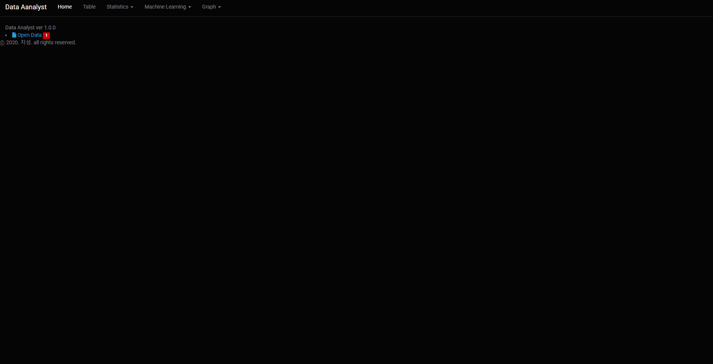

# shiny-server

# ~How to use~
1. ~Home 화면에서 분석할 데이터를 선택합니다.  
   (데이터는 전처리가 되어있는 txt, csv, xlsx만 가능합니다.)~
2. ~상단 탭에서 원하는 항목을 선택하여 분석 결과를 확인합니다.~  
  
현재는 운영하지 않습니다.

# Skills
- R
- Shiny
- Shinyapps

# Release  
|Version|Date|Comments|
|---|---|---|
|1.0.0|2020-06-28|최초 제작|

 

---

 

#### Open Source License는 [이곳](NOTICE.md)에서 확인해주시고, 문의사항은 [Issue](https://github.com/vivaan-park/shiny-server/issues) 페이지에 남겨주세요.
